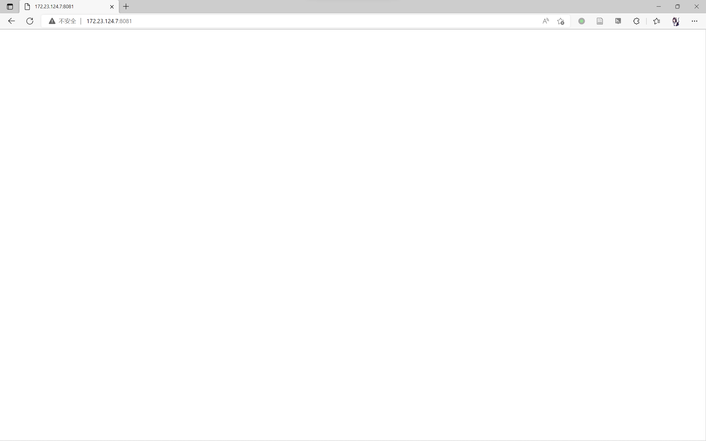
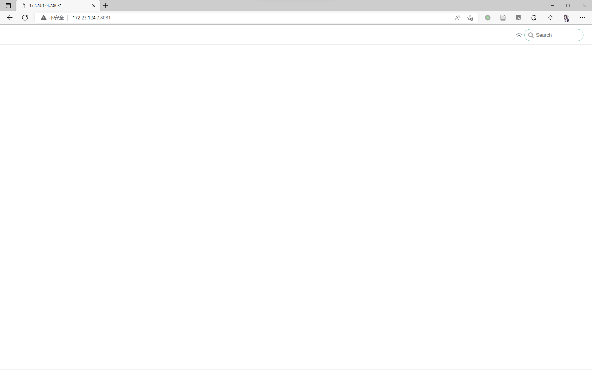

## Webpage with full-text-search plugin

You can try another code in [config.ts](docs/.vuepress/config.ts), it may avoid error report, but the result is the same.
## Webpage with node_modules removed

After `node_modules/vuepress-plugin-full-text-search2/node_modules` is removed.

